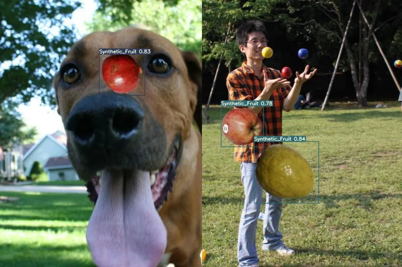
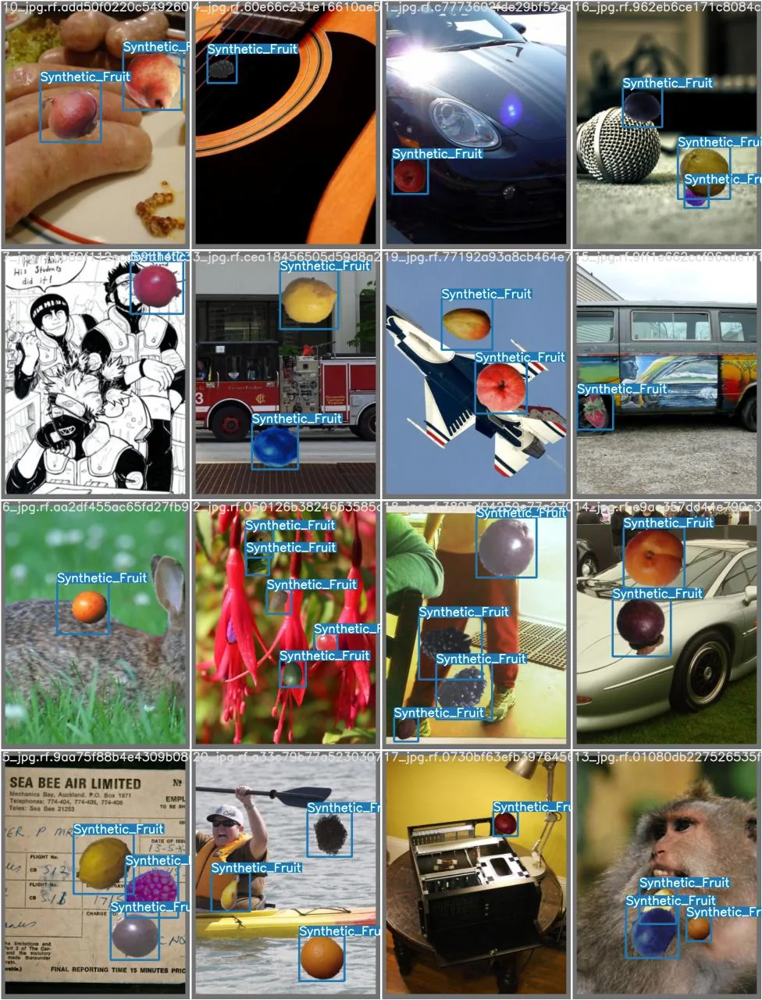
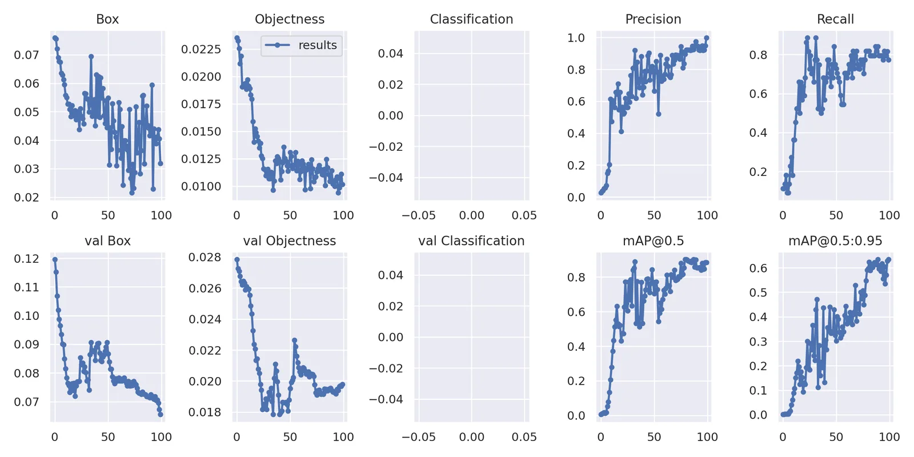

### YOLOv7 Object Detection Model Training and Evaluation

This project focuses on training and evaluating an object detection model using YOLOv7. The model is trained on a dataset to detect objects effectively, and its performance is analyzed using various metrics, including loss values, precision, recall, and mean average precision (mAP). The results are visualized to understand the model's learning progress over time.
#### Key Features  

- *YOLOv7-Based Object Detection* – Utilizes the state-of-the-art YOLOv7 architecture for high-speed and accurate object detection.
- *Model Training and Validation* – Tracks training and validation losses, including box loss, objectness loss, and classification loss.
- *Performance Metrics* – Evaluates precision, recall, and mean average precision (mAP@0.5 and mAP@0.5:0.95) to measure detection accuracy.
- *Visualization of Learning Progress* – Plots loss reduction and performance improvements over training epochs.

### Results
The YOLOv7 model demonstrated strong performance in object detection, achieving an increasing trend in precision and recall throughout training. The mAP@0.5 exceeded 60%, indicating reliable detection accuracy. The validation loss decreased significantly, confirming effective learning. The results suggest that the model is well-suited for object detection tasks, and further fine-tuning could improve performance even more.

*YOLOv7 training results: Loss reduction and performance metrics over epochs*

[🔗 GitHub Repo](https://github.com/PedroCordero/ObjectDetectionFruits)  

[back](./)
